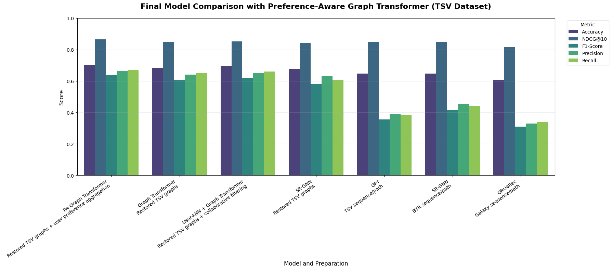

# sequential-recommendation-for-scientific-workflows

# Рекомендательная система сервисов для научных рабочих процессов с использованием графового трансформера и учёта пользовательских предпочтений

## Введение

Разработка научных рабочих процессов (workflows) для обработки больших данных, в частности пространственных данных, требует выбора подходящих инструментов из тысяч доступных. Даже опытные исследователи тратят много времени на поиск совместимых сервисов, а новички часто делают ошибочный выбор. Существующие системы рекомендаций (например, [Galaxy Tool Recommender](https://github.com/anuprulez/galaxy_tool_recommendation) или [BTR](https://github.com/ryangreenj/bioinformatics_tool_recommendation)) в основном опираются на линейные последовательности инструментов или простые графы, не учитывая ни полную структуру DAG, ни предпочтения пользователей из одной предметной области.

**Важное замечание о BTR:** 
> [!IMPORTANT]
> Для существующих опубликованных моделей (таких как BTR и GTR) общедоступный исходный код авторов представлен **исключительно для линейного представления данных** (linear sequences/paths). Тем не менее, в оригинальной статье BTR [[Green et al., 2023 (BTR)](https://doi.org/10.1101/2023.10.13.562252) приводится теоретическое и экспериментальное обоснование превосходства графового подхода над линейным. В связи с этим в данном проекте мы реализовали как классические линейные версии (BTR sequence/path), так и адаптировали подходы для работы с восстановленными графами.

В данной работе представлена **Preference‑Aware Graph Transformer (PA‑Graph Transformer)** – новая модель для рекомендации следующего сервиса в рабочем процессе, которая сочетает:

- **Графовое представление рабочего процесса** как направленного ациклического графа (DAG), что позволяет учитывать разветвления и слияния потоков данных.
- **Graph Transformer** – архитектуру, использующую relation‑aware self‑attention с учётом расстояний между узлами в глобальном графе всех инструментов.
- **Учёт предпочтений пользователей** (user preference aggregation) – для каждого пользователя (автора рабочего процесса) строится вектор частот использования сервисов, затем находятся похожие пользователи (kNN по косинусному сходству) и их история выбора следующего шага агрегируется в дополнительное распределение вероятностей. Финальный прогноз комбинирует выход Graph Transformer и этот коллаборативный сигнал.

## Сравнение с существующими подходами

Мы сравнили PA‑Graph Transformer с рядом моделей на двух наборах реальных данных:

1. **Geoportal IDSTU SB RAS** – рабочие процессы для обработки пространственных данных собранные на геопортале ИДСТУ СО РАН (уникальный датасет, собранный сотрудниками ИДСТУ СО РАН и сформированный автором).
2. **Galaxy benchmark** – публичные данные из работ [Kumar et al., 2020](https://academic.oup.com/gigascience/article/9/12/giaa152/6033133) и [Green et al., 2023 (BTR)](https://github.com/ryangreenj/bioinformatics_tool_recommendation).

В качестве бенчмарков использованы:
- **GTR** (Galaxy Tool Recommender, Kumar et al.) – GRU4Rec на линейных последовательностях.
- **BTR** (Bioinformatics Tool Recommendation, Green et al.) – SR‑GNN на линейных последовательностях (BTR sequence/path), а также вариант SR‑GNN на восстановленных графах (реализован нами, так как в официальном репозитории графовая версия отсутствует).
- **GPT** – декодерный трансформер, обученный на последовательностях.
- **SASRec**, **GRU4Rec** – классические модели session‑based рекомендаций.
- **Graph Transformer** (без учёта пользователей) на восстановленных графах.
- **User‑kNN + Graph Transformer** – коллаборативная фильтрация поверх графового трансформера.

## Результаты

### 1. Данные Geoportal IDSTU SB RAS (пространственные данные)

| Модель                     | Подготовка данных                                         | Accuracy | NDCG@10 | F1‑Score | Precision | Recall |
|----------------------------|-----------------------------------------------------------|----------|---------|----------|-----------|--------|
| **PA‑Graph Transformer**   | **Восстановленные графы + агрегация предпочтений пользователей** | **0.6869** | **0.8527** | **0.6146** | **0.6475** | **0.6612** |
| **Graph Transformer**          | **Восстановленные графы**                                     | **0.6838**   | **0.8498**  | **0.6076**   | **0.6408**    | **0.6494** |
| **User‑kNN + Graph Transformer** | **Восстановленные графы + коллаборативная фильтрация**      | **0.6815**   | **0.8504**  | **0.6108**   | **0.6449**    | **0.6543** |
| SR‑GNN                     | Восстановленные графы                                     | 0.6763   | 0.8423  | 0.5811   | 0.6310    | 0.6046 |
| GPT                        | TSV sequence/path                                         | 0.6466   | 0.8496  | 0.3558   | 0.3886    | 0.3848 |
| SR‑GNN (BTR)               | BTR‑стиль линейные последовательности                     | 0.6456   | 0.8489  | 0.4160   | 0.4546    | 0.4414 |
| GRU4Rec (GTR)              | Galaxy‑стиль линейные последовательности                  | 0.6044   | 0.8156  | 0.3103   | 0.3301    | 0.3378 |

### 2. Бенчмарк Galaxy (сравнение с опубликованными моделями)

| Модель                     | Подготовка данных                                         | Accuracy | NDCG@10 | F1‑Score | Precision | Recall |
|----------------------------|-----------------------------------------------------------|----------|---------|----------|-----------|--------|
| **PA‑Graph Transformer**   | **Восстановленные графы + агрегация предпочтений пользователей** | **0.7029** | **0.8654** | **0.6389** | **0.6621** | **0.6710** |
| **Graph Transformer**          | **Восстановленные графы**                                     | **0.6833**   | **0.8494**  | **0.6084**   | **0.6411**    | **0.6501** |
| **User‑kNN + Graph Transformer** | **Восстановленные графы + коллаборативная фильтрация**      | **0.6951**   | **0.8521**  | **0.6215**   | **0.6482**    | **0.6599** |
| SR‑GNN                     | Восстановленные графы                                     | 0.6761   | 0.8432  | 0.5809   | 0.6313    | 0.6049 |
| GPT                        | TSV sequence/path                                         | 0.6469   | 0.8486  | 0.3563   | 0.3888    | 0.3838 |
| SR‑GNN (BTR)               | BTR‑стиль линейные последовательности                     | 0.6460   | 0.8488  | 0.4162   | 0.4544    | 0.4421 |
| GRU4Rec (GTR)              | Galaxy‑стиль линейные последовательности                  | 0.6054   | 0.8156  | 0.3096   | 0.3300    | 0.3369 |

## Ключевые выводы

1. **Графовое представление** (восстановленные DAG) значительно превосходит любые линейные последовательности (Galaxy‑стиль или BTR‑стиль) при прочих равных условиях.
2. **Graph Transformer** сам по себе даёт высокие результаты, но добавление **user preference aggregation** (PA‑Graph Transformer) повышает точность, полноту и F1‑меру на обоих наборах данных.
3. Простая коллаборативная фильтрация (User‑kNN + Graph Transformer) также улучшает базовый графовый трансформер, что подтверждает важность персонализации.
4. Модель **BTR** в её **публичной реализации** использует только линейные последовательности и уступает графовым подходам. Хотя в статье BTR утверждается превосходство графового варианта, этот код и обученные модели не были опубликованы, поэтому прямое сравнение с их графовой версией невозможно.
5. Современные LLM (GPT) без специальной доработки не могут конкурировать с узкоспециализированной системой на данной задаче.

## Ссылки

- **Статья о Galaxy Tool Recommender (GTR):**  
  Kumar, A., Rasche, H., Grüning, B., Backofen, R. (2020). Tool recommender system in Galaxy using deep learning. *GigaScience*, 9(12).  
  DOI: [10.1093/gigascience/giaa152](https://doi.org/10.1093/gigascience/giaa152)  
  Репозиторий: [https://github.com/anuprulez/galaxy_tool_recommendation](https://github.com/anuprulez/galaxy_tool_recommendation)

- **Статья о BTR (Bioinformatics Tool Recommendation):**  
  Green, R., Qu, X., Liu, J., Yu, T. (2023). BTR: A Bioinformatics Tool Recommendation System. *bioRxiv*.  
  DOI: [10.1101/2023.10.13.562252](https://doi.org/10.1101/2023.10.13.562252)  
  Репозиторий: [https://github.com/ryangreenj/bioinformatics_tool_recommendation](https://github.com/ryangreenj/bioinformatics_tool_recommendation)

- **Репозиторий проекта** (PA‑Graph Transformer и все эксперименты):  
  [https://github.com/username/workflow-recommendation](hhttps://github.com/TylerCreator/sequential-recommendation-for-scientific-workflows) 

## Реализация и доступность

Исходный код всех моделей, включая PA‑Graph Transformer, доступен в указанном репозитории. Для обучения использовались публичные датасеты Galaxy и собранный набор рабочих процессов **Geoportal IDSTU SB RAS**. Модели обучаются за несколько часов на GPU среднего класса (например, RTX 3060), их размер не превышает 30 МБ.

## Заключение

Предложенная **Preference‑Aware Graph Transformer** сочетает в себе преимущества графового представления рабочих процессов, мощь архитектуры Transformer и персонализацию через коллаборативную фильтрацию. **Все варианты моделей на основе Graph Transformer (включая базовый, User‑kNN и PA‑версию) значительно превзошли ранее представленные результаты** систем GTR (Kumar et al.) и BTR (Green et al.) как на наборе пространственных данных Geoportal IDSTU SB RAS, так и на общедоступном бенчмарке Galaxy. Это подтверждает, что графовое представление и учёт структуры рабочего процесса являются ключевыми для данной задачи. Система открывает путь к созданию интеллектуальных ассистентов для разработчиков научных конвейеров, значительно ускоряющих и упрощающих выбор подходящих инструментов.
